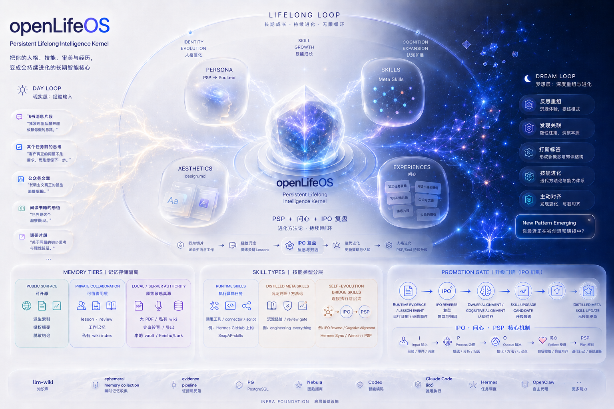

<h1 align="center">openLifeOS</h1>

<p align="center">
  <strong>Persistent Lifelong Intelligence Kernel</strong>
</p>

<p align="center">
  把一个人的人格、技能、审美、经历、记忆和长期复盘沉淀成会持续成长的智能核心。
</p>

<p align="center">
  <a href="#quick-start">Quick Start</a>
  ·
  <a href="#user-view">User View</a>
  ·
  <a href="#repo-shape">Repo Shape</a>
  ·
  <a href="#artifact-map">Artifact Map</a>
  ·
  <a href="#lifecycle">Lifecycle</a>
  ·
  <a href="#safety-boundary">Safety</a>
</p>

<p align="center">
  
  
  
  
  
</p>

<p align="center">
  
</p>

---

## What It Is

openLifeOS 不是聊天机器人，也不是把资料塞进一个知识库。

它是一个 **LifeOS factory**：用协议、模板、脚本和门禁生成某个人、团队或组织的长期智能核心。生成后的 LifeOS 会持续接收授权证据，更新人格模型、能力、审美、记忆、公开表达和运行经验。

当前结构契约是 **LifeOS schema v3**：`schemas/lifeos.schema.v3.yml`。v3 把生成实例定义为一个 **governed artifact repository**：材料、语义产物、公开投影、运行证据和治理规则分开，避免把私密原文、人格结论、Skill 和公开宣传混在一起。

核心判断：

- `sources/` 记录材料和证据边界，不直接生成人格结论。
- `identity/`、`taste/`、`meta-skills/`、`publication/` 保存经过治理的语义产物和投影。
- `runtime/sessions/` 是 LifeOS 是否真的“活着”的核心证据。
- `artifacts/current.yml` 是机器可读 latest registry。
- 结构 100% 只代表骨架和协议通过，不代表人格、能力或内容成熟。

## Quick Start

用户不需要手动理解整个目录再开始。

对 agent 说：

```text
使用 $openlifeos 初始化我的 LifeOS。
```

或更具体：

```text
使用 $openlifeos 基于我授权的 repo、wiki、docs 和近期工作初始化我的 LifeOS。
```

agent 会按阶段推进：

1. **Target Gate**：确认实名/匿名、repo 名、display name、PSP 化名、`person_id` 和语言。
2. **Boundary Gate**：确认 `local-only/private/public`、禁入材料、secret 策略和 memory 权限。
3. **Kernel Scaffold**：生成 `output/meta/<Target.LifeOS>/` 骨架和 v3 governed layers。
4. **Evidence Intake**：解释材料用途，只接收 owner-approved evidence。
5. **Synthesis**：用 InnerAtlas/Wenxin、PSP、Taste Generator、IPO Reverse 生成或更新核心产物。
6. **Progress Gate**：报告结构完成度、lifecycle stage、证据成熟度、内容缺口和下一步。

内部脚本入口：

```bash
python scripts/tui_avatar_config.py --output replicateme.yml
python scripts/apply_avatar_config.py replicateme.yml
python scripts/openlifeos_progress.py output/meta/Target.LifeOS
```

这些命令是 agent/维护者入口；正常用户只需要说明目标、边界和授权材料。

## User View

一个生成后的 LifeOS 应该先从“用户能理解的五张图”读起，而不是从目录树读起。

| 用户问题 | 先看哪里 | 说明 |
| --- | --- | --- |
| 这个 LifeOS 现在是什么状态？ | `CATALOG.md`、`LIFEOS_STATUS.yml`、`docs/evidence-sufficiency.md` | 当前阶段、证据成熟度、公开边界、下一步。 |
| 这个数字分身现在怎么介绍？ | `identity/avatar-description/current.yml` | 产品/UI/runtime 默认读的当前分身摘要，不替代证据源。 |
| 哪些结论可信？ | `artifacts/current.yml`、`identity/current.yml` | 当前 active artifact、版本入口、证据是否充分。 |
| 原始材料从哪里来？ | `sources/CATALOG.md`、`sources/authority.yml` | source authority、visibility、allowed targets、organ input packets。 |
| 人格/判断模型在哪里？ | `identity/inneratlas/current/INNERATLAS_REPORT.xml`、`identity/psp/<person_id>/current/PSP_REPORT.xml` | InnerAtlas 负责自我发现，PSP 负责 person model。 |
| 审美和表达偏好在哪里？ | `taste/current.yml`、`identity/design/current/DESIGN_TASTE.xml`、`DESIGN.md` | `taste/` 是 v3 入口，`DESIGN.md` 是兼容投影。 |
| 能力和 Skill 怎么看？ | `runtime/runtime-skills/`、`runtime/runtime-lessons/`、`evolution/ipo/`、`meta-skills/`、`capabilities/` | runtime evidence 先发生，稳定能力经 IPO 和 owner alignment 晋升。 |
| 对外表达能不能用？ | `publication/current.yml`、`publication/public-claims.yml` | 公开 profile、bio、website、article 等必须能追溯证据。 |
| AI 应该怎么读这个仓库？ | `AGENT.md`、`matrix.yml` | `AGENT.md` 是实例 agent 入口，不是可安装 Skill。 |

最重要的阅读顺序：

```text
CATALOG.md
-> artifacts/current.yml
-> identity/avatar-description/current.yml
-> sources/authority.yml
-> identity / taste / runtime / publication / meta-skills
```

## Repo Shape

本仓库是 factory；具体 LifeOS 默认生成到 `output/meta/`，不默认入仓。

```text
openLifeOS/
├── SKILL.md                         # factory 级 Codex Skill 入口
├── schemas/lifeos.schema.v3.yml     # 当前结构契约
├── migrations/                      # schema revision 迁移层
├── scripts/                         # 初始化、配置、验证、迁移和同步脚本
├── assets/avatar-skill-template*/   # 中英文生成模板
├── references/                      # memory、skill、cognition、配置契约
├── docs/architecture/               # 架构设计说明
└── output/meta/                     # 本地生成实例，默认不入仓
```

生成实例的用户视角结构：

```text
Target.LifeOS/
├── CATALOG.md                       # 人类和 agent 的总入口
├── LIFEOS_STATUS.yml                # schema、lifecycle、delivery/development 状态
├── AGENT.md                         # agent 读取、路由和安全规则
├── artifacts/current.yml            # 全局 latest registry
├── sources/                         # 真相源、材料索引、organ input packets
├── identity/                        # InnerAtlas、PSP、avatar-description、memory、cognition
├── taste/                           # text/image/interface/brand taste model
├── runtime/                         # sessions、runtime skills、runtime lessons、working memory
├── evolution/                       # organ systems、IPO、alignment、mutations
├── meta-skills/                     # 稳定 Meta Skills 和候选
├── capabilities/                    # durable capabilities 和 capability-local memory
├── publication/                     # 对外 profile、bio、website、public claims
├── identities/                      # founder/teacher/author 等社会身份投影
├── work/                            # 项目、产出、工作场景索引
├── integrations/                    # GitHub、Feishu/Lark、Hermes、data sources
├── security/                        # 禁入材料、公开策略、secret 边界
├── governance/                      # 实例级 schema、policy、decision
├── docs/                            # 人类说明、证据成熟度、产物标准
└── legacy/                          # 历史兼容材料
```

## Artifact Map

openLifeOS 的产物分三类：材料、语义源产物、投影。

| 类型 | 作用 | 例子 | 写入规则 |
| --- | --- | --- | --- |
| Source Authority | 记录材料从哪里来、能不能用、能用来生成什么 | `sources/authority.yml`、`sources/indexes/`、`sources/packets/` | 不直接写人格结论。 |
| Semantic Source Artifact | 保存 InnerAtlas、PSP、Taste、IPO 等核心结论 | `INNERATLAS_REPORT.xml`、`PSP_REPORT.xml`、`DESIGN_TASTE.xml` | 先写 timestamped artifact，再更新 current 和 registry。 |
| Product Read Model | 给用户、UI、runtime 快速读取当前状态 | `identity/avatar-description/current.yml`、`publication/current.yml` | 只能从治理后的 active artifacts 派生。 |
| Runtime Evidence | 证明 LifeOS 正在工作和学习 | `runtime/sessions/`、`runtime/runtime-lessons/` | 不自动变成长期能力。 |
| Promoted Capability | 经过 review 的稳定能力 | `capabilities/`、`meta-skills/skills/` | 需要 IPO Reverse + owner alignment。 |

关键 latest 入口：

| Artifact | Current entrypoint |
| --- | --- |
| Avatar Description | `identity/avatar-description/current.yml` |
| InnerAtlas/Wenxin | `identity/inneratlas/current/INNERATLAS_REPORT.xml` |
| PSP/person model | `identity/psp/<person_id>/current/PSP_REPORT.xml` |
| Evidence Maturity | `identity/psp/<person_id>/current/EVIDENCE_MATURITY.xml` |
| Taste/Design | `taste/current.yml`、`identity/design/current/DESIGN_TASTE.xml`、`DESIGN.md` |
| Skill recommendations | `identity/wenxin/skill-recommendations.yml` |
| Publication | `publication/current.yml`、`publication/public-claims.yml` |

## Lifecycle

LifeOS lifecycle 不是初始化进度条。

初始化 gate 回答“骨架、协议、权限和入口是否齐”；lifecycle 回答“这个数字生命是否已经开始从真实活动中成长”。

```text
sources / metabolism
-> runtime/sessions
-> runtime/runtime-skills
-> runtime/runtime-lessons
-> evolution/ipo
-> capabilities / meta-skills
```

| Stage | 名称 | 判断依据 |
| --- | --- | --- |
| 0 | Kernel Newborn | 只有骨架和 registry，没有真实材料和 session。 |
| 1 | Evidence Intake | 授权材料或 source packets 进入系统。 |
| 2 | Wenxin Complete | InnerAtlas/Wenxin 形成第一轮自我认知和定位。 |
| 3 | PSP Complete | PSP/person model 形成判断、表达、授权边界。 |
| 4 | Cloud Runtime | 出现真实 `runtime/sessions/`。 |
| 5 | Runtime Skill | 多个 session 长出局部可复用流程。 |
| 6 | Runtime Lesson | 形成待 review 的经验和失败模式。 |
| 7 | IPO Running | IPO Reverse 开始消费 session/lesson 并提出升级。 |
| 8 | Meta Skill Formation | 稳定能力进入 `capabilities/` 或 `meta-skills/skills/`。 |

`python scripts/openlifeos_progress.py <target-lifeos-repo> --json` 会输出结构完成度、lifecycle stage、内容成熟度和下一步缺口。它不是事实真伪或人格结论的最终裁判。

## Design Rules

openLifeOS 把认知对象强分型：

| 对象 | 回答的问题 | 默认位置 |
| --- | --- | --- |
| Memory | 什么是真的、偏好是什么、哪些 claim 有证据 | `identity/memories/`、`runtime/memory/`、`capabilities/*/memory/` |
| Skill | 怎么做、何时触发、怎么验证、失败怎么恢复 | `runtime/runtime-skills/`、`meta-skills/`、`capabilities/` |
| Identity | 代表谁、当前 person model 是什么 | `identity/` |
| Taste | 这个人/组织如何表达、偏好什么质感 | `taste/`、`identity/design/`、`DESIGN.md` |
| Publication | 哪些内容可以对外说 | `publication/` |
| Governance | 规则、schema、policy、decision | `governance/`、`security/` |

混合材料写入前必须拆分：事实进入 memory，流程进入 Skill proposal，公开表达进入 publication，权限规则进入 governance/security。

## Safety Boundary

openLifeOS 不是私人原始资料仓库。

不要提交：

- GitHub token、Feishu app secret、tenant token、user token。
- cookie、refresh token、私钥、密码。
- 原始会议转写、私人聊天记录、客户资料、合同、财务和证件。
- 未授权的 wiki 正文、私人文档和敏感原始材料。

默认策略：

- public surface 只放 owner-approved 派生内容。
- private collaboration 放可信协同记忆。
- local/server authority 保存原始敏感材料。
- Feishu/Lark 相关操作使用 `larkcli`，凭证只走环境变量、密码管理器或官方授权流程。

## Related Docs

- `docs/architecture/lifeos-schema-v3-governed-artifact-repo.md`
- `docs/architecture/lifeos-lifecycle.md`
- `references/memory-isolation-model.md`
- `references/cognition-object-taxonomy.md`
- `references/skill-taxonomy-and-promotion.md`
- `references/replicateme-yaml.md`

## License

openLifeOS is source-available software for non-commercial use only.

This repository is licensed under the PolyForm Noncommercial License 1.0.0. You may use, copy, modify, and distribute the software for non-commercial purposes, subject to the license terms. Commercial use, resale, hosted commercial services, or use inside paid products requires explicit written permission from MetaInFlow.

See `LICENSE` for the full terms.
