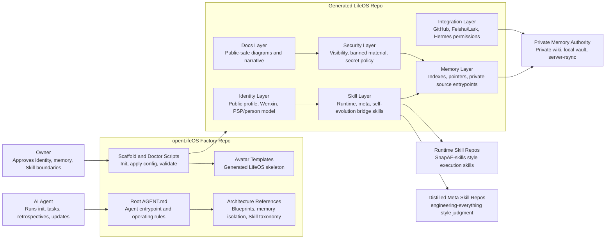

# Container Flowchart - openLifeOS

```mermaid
flowchart LR
  owner["Owner<br/>Approves identity, memory, Skill boundaries"]
  agent["AI Agent<br/>Runs init, tasks, retrospectives, updates"]

  subgraph factory["openLifeOS Factory Repo"]
    rootSkill["Root AGENT.md<br/>Agent entrypoint and operating rules"]
    templates["Avatar Templates<br/>Generated LifeOS skeleton"]
    scripts["Scaffold and Doctor Scripts<br/>Init, apply config, validate"]
    refs["Architecture References<br/>Blueprints, memory isolation, Skill taxonomy"]
  end

  subgraph lifeos["Generated LifeOS Repo"]
    identity["Identity Layer<br/>Public profile, Wenxin, PSP/person model"]
    skills["Skill Layer<br/>Runtime, meta, self-evolution bridge skills"]
    memory["Memory Layer<br/>Indexes, pointers, private source entrypoints"]
    integrations["Integration Layer<br/>GitHub, Feishu/Lark, Hermes permissions"]
    security["Security Layer<br/>Visibility, banned material, secret policy"]
    docs["Docs Layer<br/>Public-safe diagrams and narrative"]
  end

  privateMemory["Private Memory Authority<br/>Private wiki, local vault, server-rsync"]
  runtimeRepo["Runtime Skill Repos<br/>SnapAF-skills style execution skills"]
  metaRepo["Distilled Meta Skill Repos<br/>engineering-everything style judgment"]

  owner --> scripts
  agent --> rootSkill
  rootSkill --> refs
  scripts --> templates
  scripts --> lifeos
  identity --> skills
  skills --> memory
  memory --> privateMemory
  skills --> runtimeRepo
  skills --> metaRepo
  integrations --> privateMemory
  security --> memory
  docs --> security
```
