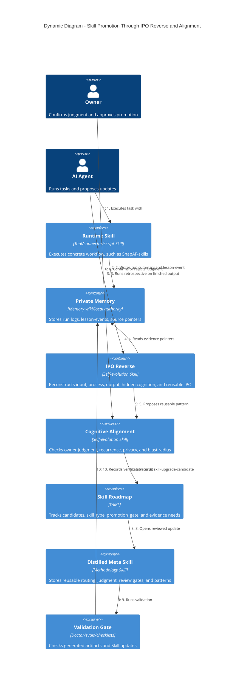

# Dynamic Diagram - Runtime Skill to Distilled Meta Skill Promotion

```mermaid
C4Dynamic
  title Dynamic Diagram - Skill Promotion Through IPO Reverse and Alignment

  Person(owner, "Owner", "Confirms judgment and approves promotion")
  Person(agent, "AI Agent", "Runs tasks and proposes updates")

  Container(runtimeSkill, "Runtime Skill", "Tool/connector/script Skill", "Executes concrete workflow, such as SnapAF-skills")
  Container(privateMemory, "Private Memory", "Memory wiki/local authority", "Stores run logs, lesson-events, source pointers")
  Container(ipoReverse, "IPO Reverse", "Self-evolution Skill", "Reconstructs input, process, output, hidden cognition, and reusable IPO")
  Container(alignment, "Cognitive Alignment", "Self-evolution Skill", "Checks owner judgment, recurrence, privacy, and blast radius")
  Container(roadmap, "Skill Roadmap", "YAML", "Tracks candidates, skill_type, promotion_gate, and evidence needs")
  Container(metaSkill, "Distilled Meta Skill", "Methodology Skill", "Stores reusable routing, judgment, review gates, and patterns")
  Container(doctor, "Validation Gate", "Doctor/evals/checklists", "Checks generated artifacts and Skill updates")

  Rel(agent, runtimeSkill, "1. Executes task with")
  Rel(runtimeSkill, privateMemory, "2. Writes run summary and lesson-event")
  Rel(agent, ipoReverse, "3. Runs retrospective on finished output")
  Rel(ipoReverse, privateMemory, "4. Reads evidence pointers")
  Rel(ipoReverse, alignment, "5. Proposes reusable pattern")
  Rel(owner, alignment, "6. Confirms or rejects judgment")
  Rel(alignment, roadmap, "7. Records skill-upgrade-candidate")
  Rel(roadmap, metaSkill, "8. Opens reviewed update")
  Rel(metaSkill, doctor, "9. Runs validation")
  Rel(doctor, privateMemory, "10. Records verification result")

  UpdateRelStyle(runtimeSkill, privateMemory, $offsetY="-20")
  UpdateRelStyle(roadmap, metaSkill, $offsetY="-20")
  UpdateLayoutConfig($c4ShapeInRow="3", $c4BoundaryInRow="1")
```
