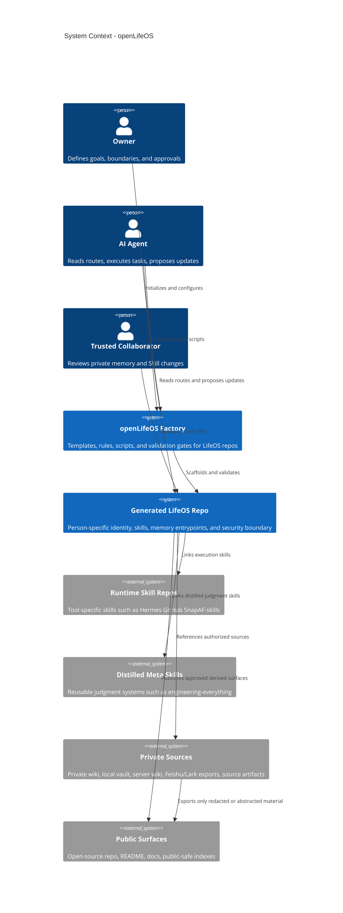

# System Context - openLifeOS

```mermaid
C4Context
  title System Context - openLifeOS

  Person(owner, "Owner", "Defines goals, boundaries, and approvals")
  Person(agent, "AI Agent", "Reads routes, executes tasks, proposes updates")
  Person(collaborator, "Trusted Collaborator", "Reviews private memory and Skill changes")

  System(openlifeos, "openLifeOS Factory", "Templates, rules, scripts, and validation gates for LifeOS repos")
  System(lifeosRepo, "Generated LifeOS Repo", "Person-specific identity, skills, memory entrypoints, and security boundary")

  System_Ext(runtimeRepos, "Runtime Skill Repos", "Tool-specific skills such as Hermes GitHub SnapAF-skills")
  System_Ext(metaSkills, "Distilled Meta Skills", "Reusable judgment systems such as engineering-everything")
  System_Ext(privateSources, "Private Sources", "Private wiki, local vault, server wiki, Feishu/Lark exports, source artifacts")
  System_Ext(publicSurfaces, "Public Surfaces", "Open-source repo, README, docs, public-safe indexes")

  Rel(owner, openlifeos, "Initializes and configures")
  Rel(agent, openlifeos, "Uses rules and scripts")
  Rel(openlifeos, lifeosRepo, "Scaffolds and validates")
  Rel(agent, lifeosRepo, "Reads routes and proposes updates")
  Rel(collaborator, lifeosRepo, "Reviews private PRs")
  Rel(lifeosRepo, privateSources, "References authorized sources")
  Rel(lifeosRepo, runtimeRepos, "Links execution skills")
  Rel(lifeosRepo, metaSkills, "Links distilled judgment skills")
  Rel(lifeosRepo, publicSurfaces, "Publishes approved derived surfaces")
  Rel(privateSources, publicSurfaces, "Exports only redacted or abstracted material")

  UpdateLayoutConfig($c4ShapeInRow="3", $c4BoundaryInRow="1")
```
